## 简介

- **Vue_Shared_Blog** 是一个基于 `vue` 和 `spring-boot` 开发的一个共享博客系统

- 可以实现以下基本功能

  - 用户的登陆退出
  - 博客的增删改查
  - 用户对博客的权限管理

## 主要技术

- 后端
  - `SpringBoot`：项目骨架
  - `mybatis-plus`：持久层框架，简化 crud 操作
  - `shiro`：权限控制框架，配置简单
  - `lombok`：简化 javabean 操作
  - `redis`：会话共享
  - `hibernate-validatior`：数据校验
  - `jwt`：用户身份凭证
- 前端
  - `vue`
  - `element-ui`
  - `axios`
  - `mavon-editor`
  - `markdown-it`
  - `github-markdown-css`

## 开发环境

- 后端
  - idea
  - mysql 8.0
  - jdk 11
  - maven3
- 前端
  - node

## 数据库信息

|           用户信息            |           博客信息            |
| :---------------------------: | :---------------------------: |
| 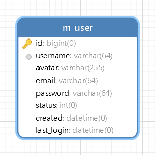 | 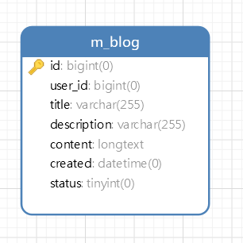 |

## 项目结构

```
Vue_Shared_Blog
|
|- vue_blog 后端项目，基于 spring-boot 开发
|
|- vue_blog_ui 前端项目，基于 vue 开发
|
|- img 项目演示图片
|
|- sql 项目数据库文件
|
|- README.md 项目介绍
```

## 项目展示

|  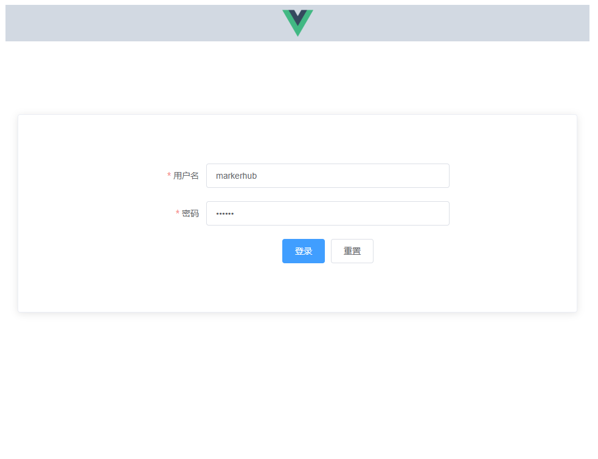  |   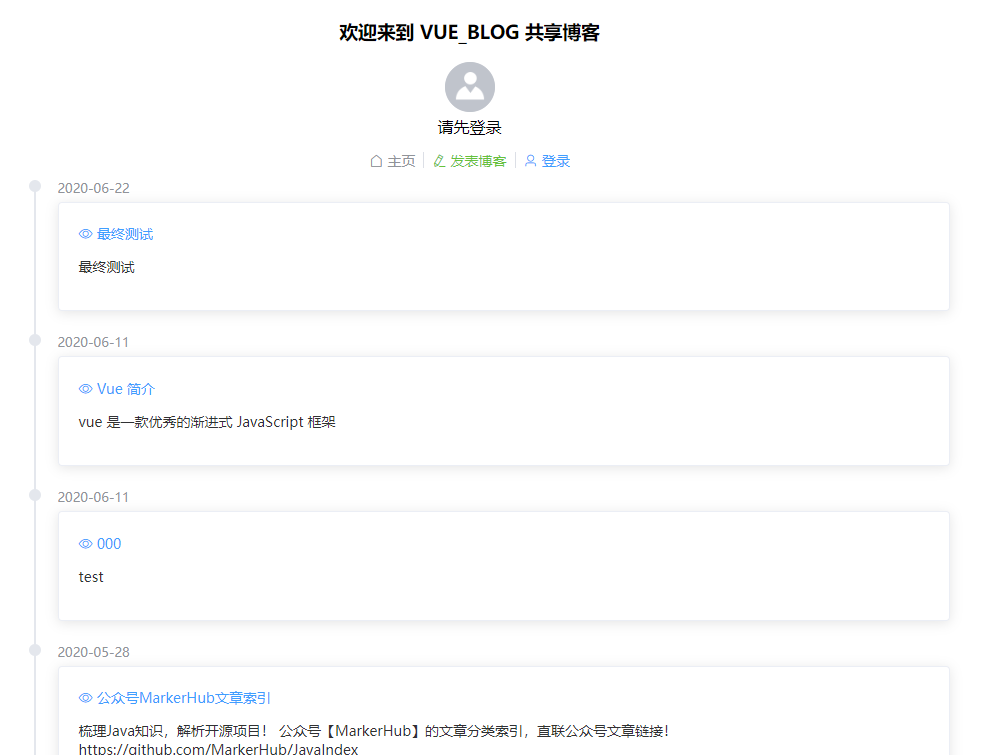   |     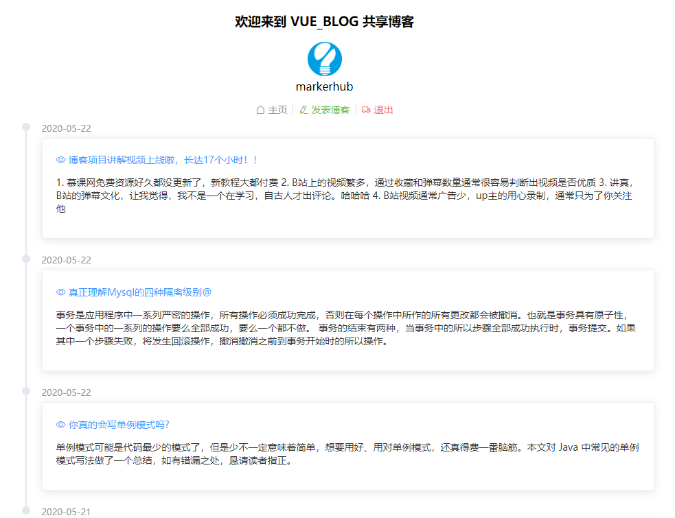     |
| :-------------------------: | :-------------------------: | :-------------------------------------------: |
|          登录窗口           |      博客列表(未登录)       |               博客列表(已登录)                |
|    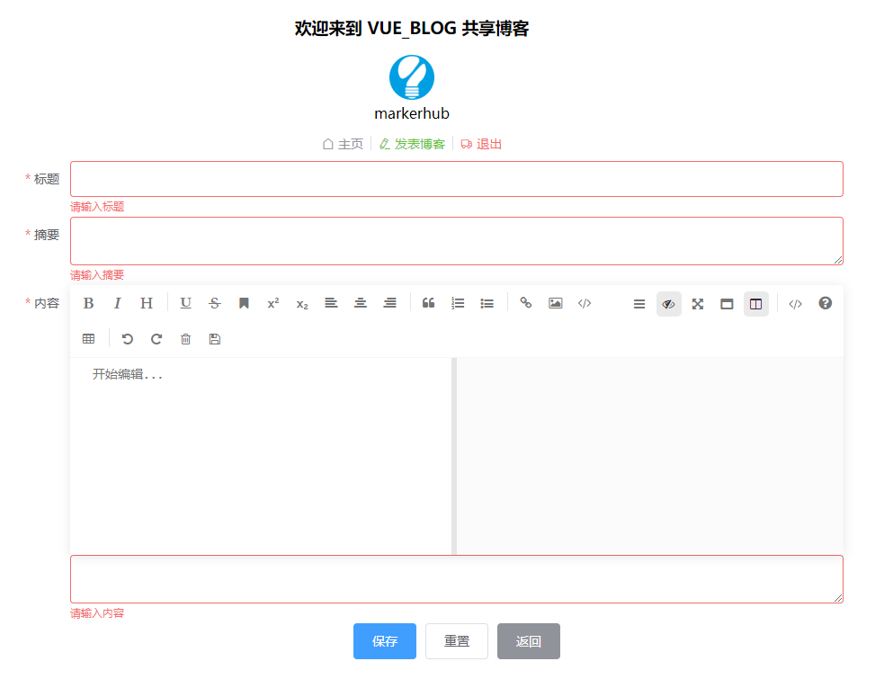    | 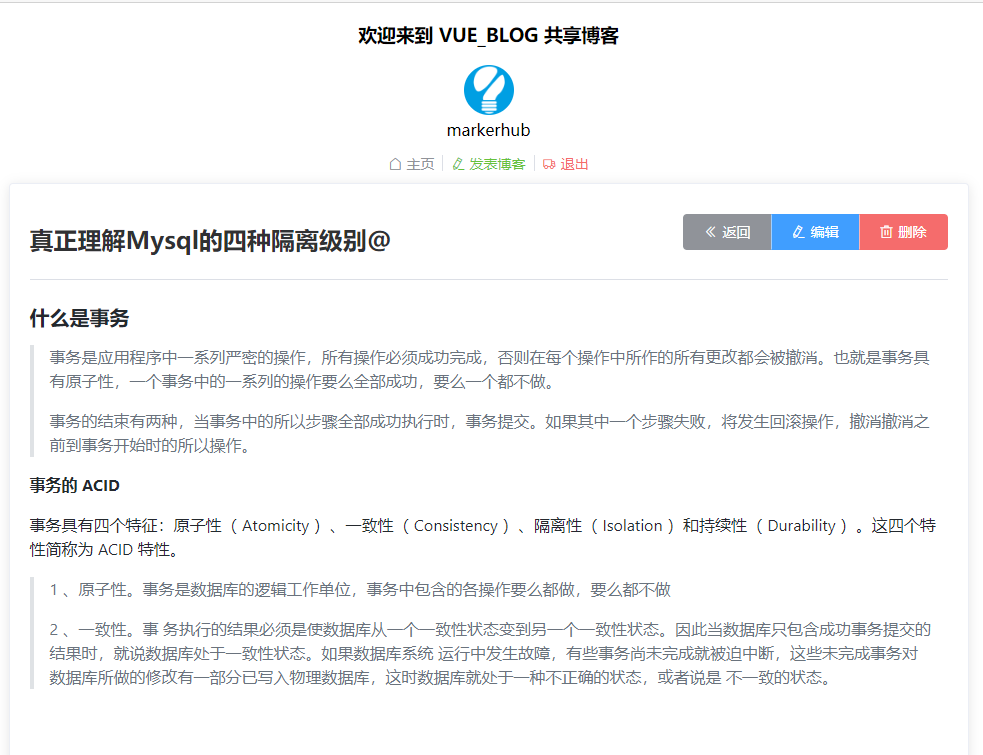 | 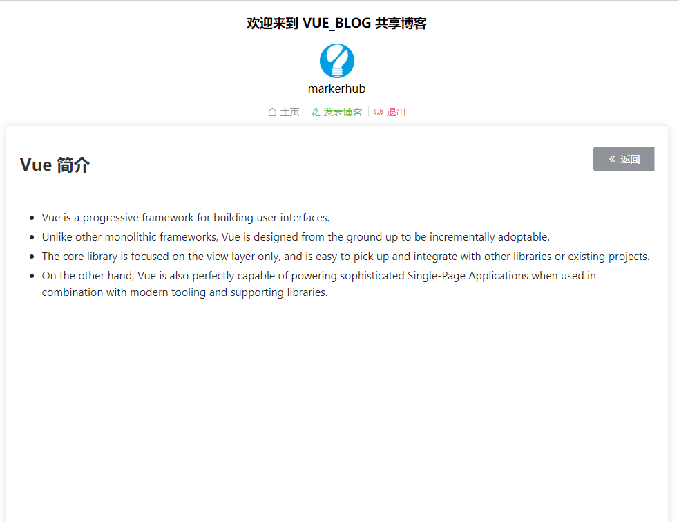 |
|          博客添加           |      博客详情(可操作)       |                博客详情(只读)                 |
| 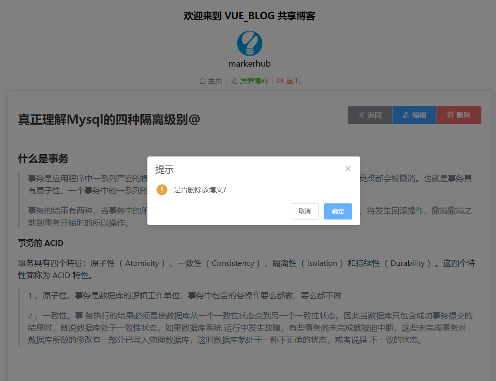 |   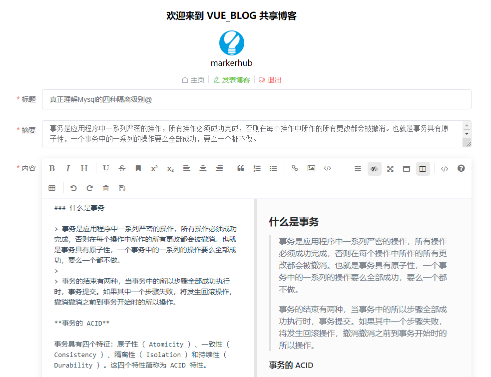   |          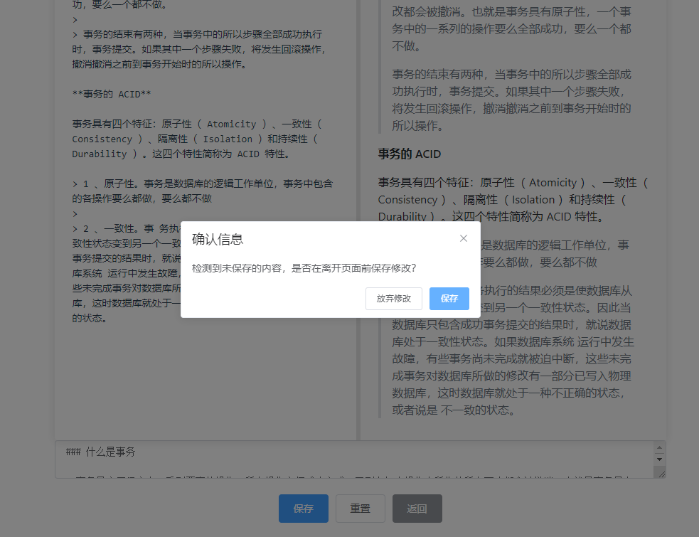          |
|          博客删除           |          博客编辑           |                   编辑检测                    |
